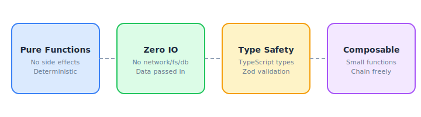
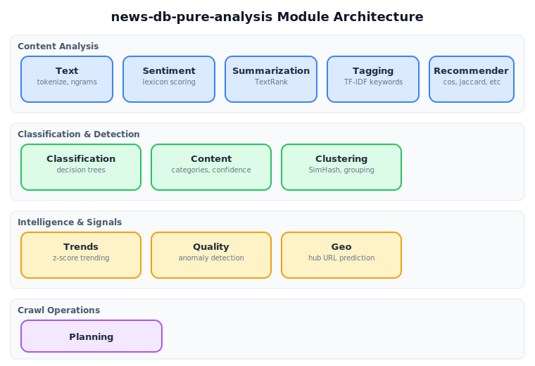
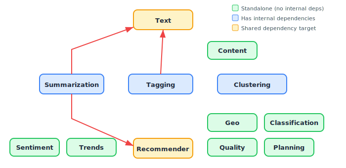

# Chapter 1: Introduction & Architecture

## What Is news-db-pure-analysis?

`news-db-pure-analysis` is a **zero-IO, pure-functional analysis library** for news platform intelligence. It provides algorithms for clustering, classification, sentiment analysis, trend detection, content quality scoring, summarization, keyword extraction, geographic URL prediction, similarity computation, and crawl prioritization.

Every function in this library is **deterministic and side-effect free**. There are no network calls, no file reads, no database queries, and no mutable global state. Data goes in, results come out.

This library is one module in a larger news platform system. It is the **brain** — the other modules handle IO (crawling, database access, API serving). This module handles the thinking.

## Design Principles

```
01-fig-design-principles.svg
```

<p align="center">

</p>

| Principle | What It Means |
|---|---|
| **Pure Functions** | Same input always produces same output. No hidden state. |
| **Zero IO** | No network, filesystem, or database access. All data is passed in. |
| **Type Safety** | Full TypeScript types + Zod runtime validation schemas for all boundaries. |
| **Composable** | Small functions that chain together. Use only what you need. |
| **Deterministic** | No randomness, no time-dependency in algorithms (time is an input). |
| **JSON-Serializable** | All outputs are plain objects/arrays. No custom classes leak out (except `TextRank` which is intentionally a class). |

## Architecture Overview

```
01-fig-architecture.svg
```

<p align="center">

</p>

The library is organized into 12 independent modules, each in its own directory under `src/`:

| Module | Directory | Purpose |
|---|---|---|
| **Text** | `src/text/` | Tokenization, stopwords, n-grams, word frequency |
| **Clustering** | `src/clustering/` | SimHash fingerprinting, Hamming distance, article grouping |
| **Sentiment** | `src/sentiment/` | Lexicon-based sentiment scoring with negation/amplification |
| **Classification** | `src/classification/` | Decision tree engine with audit trails |
| **Content** | `src/content/` | Page category detection, extraction quality scoring |
| **Trends** | `src/trends/` | Statistical trend detection using z-scores |
| **Quality** | `src/quality/` | Time series anomaly detection |
| **Summarization** | `src/summarization/` | TextRank extractive summarization |
| **Tagging** | `src/tagging/` | TF-IDF keyword extraction |
| **Geo** | `src/geo/` | Hub URL prediction for geographic places |
| **Recommender** | `src/recommender/` | Vector similarity (cosine, Jaccard, Euclidean) |
| **Planning** | `src/planning/` | Crawl URL prioritization scoring |

## Dependency Graph Between Modules

Most modules are fully standalone. The internal dependency graph is minimal:

```
01-fig-dependencies.svg
```

<p align="center">

</p>

- **Summarization** depends on **Text** (for tokenization) and **Recommender** (for Jaccard similarity)
- **Tagging** depends on **Text** (for tokenization with stopword removal)
- **Clustering/grouper** depends on **Clustering/similarity** (for Hamming distance)
- All other modules are **fully independent**

## Installation

```bash
npm install news-db-pure-analysis
```

## Importing

```typescript
// ESM (recommended)
import { computeSimHash, analyzeSentiment, detectTrends } from 'news-db-pure-analysis';

// CommonJS
const { computeSimHash, analyzeSentiment, detectTrends } = require('news-db-pure-analysis');
```

Everything is exported from the single package entry point. There are no deep imports needed.

## External Dependencies

This library has only **two runtime dependencies**:

| Dependency | Version | Purpose |
|---|---|---|
| `zod` | ^3.22.0 | Runtime schema validation for input boundaries |
| `date-fns` | ^3.0.0 | Date utility functions |

Both are small, well-maintained, tree-shakeable libraries.

## Where This Module Fits

This library is designed to be consumed by:

- **API servers** that apply analysis to articles in request handlers
- **Crawl workers** that score URLs for prioritization
- **Batch jobs** that cluster articles, detect trends, or generate summaries
- **Frontend applications** that need client-side text analysis
- **Other pure modules** that compose on top of these functions

It deliberately does **not** concern itself with:

- Where the data comes from (databases, APIs, files)
- Where the results go (storage, caches, response bodies)
- Authentication, authorization, or rate limiting
- Logging, metrics, or tracing

Those concerns belong to the IO layer that wraps this module.
