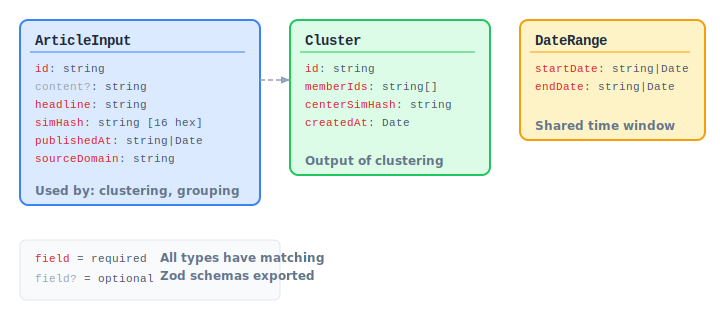

# Chapter 2: Input Data Contracts & Shared Types

Every function in this library operates on well-defined data shapes. This chapter documents every input type, every output type, and the Zod schemas that validate them at runtime.

## Core Shared Types

These types are defined in `src/types.ts` and used across multiple modules.

```
02-fig-core-types.svg
```

<p align="center">

</p>

### DateRange

A time window used for filtering operations.

```typescript
import { DateRangeSchema, DateRange } from 'news-db-pure-analysis';

// Schema
const DateRangeSchema = z.object({
    startDate: z.string().or(z.date()),
    endDate: z.string().or(z.date())
});

// Example
const range: DateRange = {
    startDate: '2024-01-01',
    endDate: '2024-01-31'
};
```

| Field | Type | Required | Description |
|---|---|---|---|
| `startDate` | `string \| Date` | Yes | Start of the range (ISO string or Date object) |
| `endDate` | `string \| Date` | Yes | End of the range (ISO string or Date object) |

### ArticleInput

The primary input type for article analysis. This is the shape your articles must conform to when passing them to clustering, similarity, and grouping functions.

```typescript
import { ArticleInputSchema, ArticleInput } from 'news-db-pure-analysis';

// Schema
const ArticleInputSchema = z.object({
    id: z.string(),
    content: z.string().optional(),
    headline: z.string(),
    simHash: z.string().regex(/^[a-fA-F0-9]{16}$/),
    publishedAt: z.string().or(z.date()),
    sourceDomain: z.string()
});

// Example
const article: ArticleInput = {
    id: 'art-001',
    content: 'Full article text here...',
    headline: 'Breaking: Major Event Occurs',
    simHash: 'a1b2c3d4e5f6a7b8',  // 64-bit hex fingerprint
    publishedAt: '2024-06-15T10:30:00Z',
    sourceDomain: 'example.com'
};
```

| Field | Type | Required | Description |
|---|---|---|---|
| `id` | `string` | Yes | Unique article identifier |
| `content` | `string` | No | Full article body text |
| `headline` | `string` | Yes | Article headline/title |
| `simHash` | `string` | Yes | 64-bit SimHash as 16-char hex. Must match `/^[a-fA-F0-9]{16}$/` |
| `publishedAt` | `string \| Date` | Yes | Publication timestamp |
| `sourceDomain` | `string` | Yes | Source domain (e.g., `"reuters.com"`) |

**Important:** The `simHash` field must be pre-computed before passing articles to clustering functions. Use `computeSimHash(text)` from this library to generate it from article content.

### Cluster

Output type representing a group of related articles.

```typescript
import { ClusterSchema, Cluster } from 'news-db-pure-analysis';

const ClusterSchema = z.object({
    id: z.string(),
    memberIds: z.array(z.string()),
    centerSimHash: z.string(),
    createdAt: z.date()
});
```

| Field | Type | Description |
|---|---|---|
| `id` | `string` | Cluster identifier |
| `memberIds` | `string[]` | IDs of articles in this cluster |
| `centerSimHash` | `string` | SimHash of the cluster center |
| `createdAt` | `Date` | When the cluster was created |

## Module-Specific Input Types

### UrlSignals (Planning Module)

```typescript
import { UrlSignalsSchema, UrlSignals } from 'news-db-pure-analysis';

const example: UrlSignals = {
    url: 'https://example.com/news/politics',
    visits: 42,
    lastVisited: '2024-06-14T08:00:00Z',
    lastChanged: '2024-06-15T06:00:00Z',
    topicRelevance: 0.85,
    hubDepth: 1,
    isHub: true
};
```

| Field | Type | Required | Default | Description |
|---|---|---|---|---|
| `url` | `string` | Yes | — | Valid URL to score |
| `visits` | `number` | Yes | — | Total visit count (integer >= 0) |
| `lastVisited` | `Date \| string` | Yes | — | When the URL was last crawled |
| `lastChanged` | `Date \| string` | No | — | When content was last detected as changed |
| `topicRelevance` | `number` | No | `0.5` | Topic relevance score (0.0 to 1.0) |
| `hubDepth` | `number` | No | `0` | URL depth from root (integer >= 0) |
| `isHub` | `boolean` | No | `false` | Whether this is a hub/index page |

### TimeSeriesPoint (Quality Module)

```typescript
import { TimeSeriesPointSchema, TimeSeriesPoint } from 'news-db-pure-analysis';

const point: TimeSeriesPoint = {
    date: '2024-06-15',
    value: 142
};
```

| Field | Type | Required | Description |
|---|---|---|---|
| `date` | `string \| Date` | Yes | Timestamp for this data point |
| `value` | `number` | Yes | Numeric value to analyze |

### TopicCount (Trends Module)

```typescript
import { TopicCountSchema, TopicCount } from 'news-db-pure-analysis';

const count: TopicCount = {
    topicId: 'politics',
    topicName: 'Politics',
    date: '2024-06-15',
    count: 47
};
```

| Field | Type | Required | Description |
|---|---|---|---|
| `topicId` | `string \| number` | Yes | Unique topic identifier |
| `topicName` | `string` | No | Human-readable topic name |
| `date` | `string` | Yes | Date for this count |
| `count` | `number` | Yes | Article count for this topic on this date |

### ExtractionInput (Content Module)

```typescript
import { ExtractionInputSchema, ExtractionInput } from 'news-db-pure-analysis';

const extraction: ExtractionInput = {
    title: 'Major Political Shift in European Parliament',
    content: 'Full article text...',
    author: 'Jane Smith',
    publishDate: '2024-06-15',
    section: 'Politics',
    wordCount: 850
};
```

| Field | Type | Required | Description |
|---|---|---|---|
| `title` | `string` | No | Extracted page title |
| `content` | `string` | No | Extracted article body |
| `author` | `string` | No | Author name |
| `publishDate` | `string` | No | Publication date string |
| `section` | `string` | No | Section/category of the article |
| `wordCount` | `number` | No | Pre-computed word count (auto-calculated from content if omitted) |

### PlaceMetadata (Geo Module)

```typescript
import { PlaceMetadataSchema, PlaceMetadata } from 'news-db-pure-analysis';

const place: PlaceMetadata = {
    name: 'United Kingdom',
    code: 'GB',
    slug: 'uk',
    nameVariants: ['Britain', 'Great Britain'],
    region: 'Europe',
    importance: 0.95
};
```

| Field | Type | Required | Description |
|---|---|---|---|
| `name` | `string` | Yes | Primary place name |
| `code` | `string` | No | ISO country/region code |
| `slug` | `string` | No | Pre-defined URL slug |
| `nameVariants` | `string[]` | No | Alternative names for URL matching |
| `region` | `string` | No | Parent region |
| `importance` | `number` | No | Importance weight for prioritization |

### EvaluationContext (Classification Module)

```typescript
import { EvaluationContext } from 'news-db-pure-analysis';

const context: EvaluationContext = {
    url: 'https://example.com/opinion/editorial-on-climate',
    title: 'Editorial: Climate Action Now',
    content: 'The time for action is...',
    wordCount: 1200,
    flags: { isPremium: true, hasPaywall: false }
};
```

| Field | Type | Required | Description |
|---|---|---|---|
| `url` | `string` | No | Page URL for URL-based conditions |
| `title` | `string` | No | Page title for text matching |
| `content` | `string` | No | Page body for text matching |
| `wordCount` | `number` | No | Word count for numeric comparisons |
| `flags` | `Record<string, boolean>` | No | Boolean flags for flag-type conditions |
| `[key: string]` | `any` | No | Any additional fields for `compare` conditions |

## Zod Schema Validation

Every input type has a corresponding Zod schema exported alongside it. Use these schemas for runtime validation at your system boundaries:

```typescript
import { ArticleInputSchema, UrlSignalsSchema } from 'news-db-pure-analysis';

// Validate incoming data
function processArticle(raw: unknown) {
    const article = ArticleInputSchema.parse(raw); // throws ZodError if invalid
    // article is now typed as ArticleInput
}

// Safe parse (no throw)
function tryProcessArticle(raw: unknown) {
    const result = ArticleInputSchema.safeParse(raw);
    if (result.success) {
        return result.data; // typed as ArticleInput
    } else {
        console.error(result.error.issues);
        return null;
    }
}
```

### Exported Schemas Reference

| Schema | Validates | Module |
|---|---|---|
| `DateRangeSchema` | `DateRange` | types |
| `ArticleInputSchema` | `ArticleInput` | types |
| `ClusterSchema` | `Cluster` | types |
| `UrlSignalsSchema` | `UrlSignals` | planning |
| `ScoredUrlSchema` | `ScoredUrl` | planning |
| `TimeSeriesPointSchema` | `TimeSeriesPoint` | quality |
| `AnomalySchema` | `Anomaly` | quality |
| `SentimentResultSchema` | `SentimentResult` | sentiment |
| `TopicCountSchema` | `TopicCount` | trends |
| `TrendResultSchema` | `TrendResult` | trends |
| `ConditionSchema` | `Condition` | classification |
| `DecisionNodeSchema` | `DecisionNode` | classification |
| `ExtractionInputSchema` | `ExtractionInput` | content |
| `ConfidenceResultSchema` | `ConfidenceResult` | content |
| `CategoryResultSchema` | `CategoryResult` | content |
| `PlaceMetadataSchema` | `PlaceMetadata` | geo |
| `UrlPatternSchema` | `UrlPattern` | geo |
| `TextRankOptionsSchema` | `TextRankOptions` | summarization |
