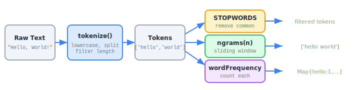

# Chapter 3: Text Processing

The `text` module (`src/text/`) provides shared tokenization and text analysis utilities used by other modules and available for direct use.

```
03-fig-text-pipeline.svg
```

<p align="center">

</p>

## Exports

| Export | Kind | Description |
|---|---|---|
| `tokenize` | Function | Split text into word tokens with configurable options |
| `splitSentences` | Function | Split text on sentence boundaries |
| `countWords` | Function | Count words in text |
| `ngrams` | Function | Extract n-grams from token arrays |
| `wordFrequency` | Function | Build frequency map from text |
| `topWords` | Function | Get top N words by frequency |
| `isLikelyEnglish` | Function | Heuristic English language detection |
| `STOPWORDS` | Constant | Set of 80+ common English stopwords |
| `TokenizeOptions` | Type | Options interface for `tokenize` |

## STOPWORDS

The `STOPWORDS` constant is a `Set<string>` containing 80+ common English words that are typically excluded from analysis:

```typescript
import { STOPWORDS } from 'news-db-pure-analysis';

// Check membership
STOPWORDS.has('the');  // true
STOPWORDS.has('election');  // false

// Use in custom processing
const filtered = tokens.filter(t => !STOPWORDS.has(t));
```

The set includes articles (`a`, `an`, `the`), conjunctions (`and`, `or`, `but`), prepositions (`in`, `on`, `at`), pronouns (`i`, `you`, `he`, `she`), auxiliary verbs (`is`, `was`, `have`), and common modifiers (`very`, `just`, `now`).

## tokenize(text, options?)

Splits text into an array of word tokens.

```typescript
import { tokenize } from 'news-db-pure-analysis';

tokenize('Hello, World!');
// ['hello', 'world']

tokenize('The quick brown fox', { removeStopwords: true });
// ['quick', 'brown', 'fox']

tokenize('AI is great', { minLength: 3 });
// ['great']

tokenize('Mixed CASE text', { lowercase: false });
// ['Mixed', 'CASE', 'text']
```

### TokenizeOptions

| Option | Type | Default | Description |
|---|---|---|---|
| `minLength` | `number` | `2` | Minimum token length to include |
| `removeStopwords` | `boolean` | `false` | Remove common English stopwords |
| `lowercase` | `boolean` | `true` | Convert all tokens to lowercase |

### Processing Steps

1. Optionally convert to lowercase
2. Replace non-word characters (except hyphens and apostrophes) with spaces
3. Split on whitespace
4. Filter by minimum length
5. Optionally remove stopwords

## splitSentences(text)

Splits text into sentences on `.`, `!`, and `?` boundaries.

```typescript
import { splitSentences } from 'news-db-pure-analysis';

splitSentences('Hello world. How are you? Great!');
// ['Hello world', 'How are you', 'Great']
```

Returns trimmed, non-empty sentence strings.

## countWords(text)

Counts the number of words in text (using `tokenize` with `minLength: 1`).

```typescript
import { countWords } from 'news-db-pure-analysis';

countWords('The quick brown fox jumps over the lazy dog');
// 9
```

## ngrams(tokens, n)

Extracts n-grams from a pre-tokenized array.

```typescript
import { ngrams, tokenize } from 'news-db-pure-analysis';

const tokens = tokenize('the quick brown fox');
// ['the', 'quick', 'brown', 'fox']

ngrams(tokens, 2);
// ['the quick', 'quick brown', 'brown fox']

ngrams(tokens, 3);
// ['the quick brown', 'quick brown fox']
```

Returns an empty array if the token array is shorter than `n`.

## wordFrequency(text, options?)

Builds a `Map<string, number>` of word frequencies.

```typescript
import { wordFrequency } from 'news-db-pure-analysis';

const freq = wordFrequency('the cat sat on the mat');
// Map { 'the' => 2, 'cat' => 1, 'sat' => 1, 'on' => 1, 'mat' => 1 }

const freqNoStop = wordFrequency('the cat sat on the mat', { removeStopwords: true });
// Map { 'cat' => 1, 'sat' => 1, 'mat' => 1 }
```

Accepts the same `TokenizeOptions` as `tokenize`.

## topWords(text, n?, options?)

Returns the top N words by frequency as an array of `{ word, count }` objects.

```typescript
import { topWords } from 'news-db-pure-analysis';

topWords('cat dog cat bird cat dog', 2);
// [{ word: 'cat', count: 3 }, { word: 'dog', count: 2 }]
```

| Parameter | Type | Default | Description |
|---|---|---|---|
| `text` | `string` | — | Text to analyze |
| `n` | `number` | `10` | Number of top words to return |
| `options` | `TokenizeOptions` | `{}` | Tokenization options |

## isLikelyEnglish(text)

A heuristic that estimates whether text is in English by checking stopword density.

```typescript
import { isLikelyEnglish } from 'news-db-pure-analysis';

isLikelyEnglish('The president spoke to the nation about the economy');
// true

isLikelyEnglish('Der Praesident sprach zur Nation');
// false (< 10% stopword density)
```

**Algorithm:** Tokenizes the text, counts how many tokens are in the `STOPWORDS` set, and returns `true` if at least 10% of tokens are English stopwords. Returns `true` for texts with fewer than 5 tokens (too short to determine).

**Limitation:** This is a simple heuristic, not a proper language detector. It works well for news headlines and article bodies but can be fooled by short or domain-specific text.
