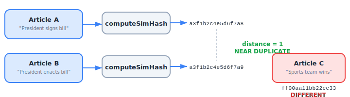
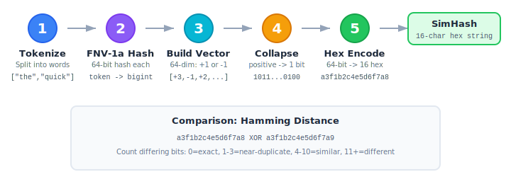

# Chapter 4: SimHash & Near-Duplicate Clustering

The `clustering` module (`src/clustering/`) provides 64-bit SimHash fingerprinting, Hamming distance comparison, and greedy article grouping. This is the core deduplication engine.

```
04-fig-simhash-overview.svg
```

<p align="center">

</p>

## How SimHash Works

SimHash is a locality-sensitive hash: similar inputs produce similar hashes. Two articles about the same event will have nearly identical SimHash values, even if the wording differs slightly.

### The Algorithm

```
04-fig-simhash-algorithm.svg
```

<p align="center">

</p>

1. **Tokenize** the text into words (minimum length 2, lowercased)
2. **Hash** each token using FNV-1a 64-bit
3. **Build a 64-dimensional vector:** For each bit position (0-63), if the token's hash bit is 1, add +1; if 0, add -1
4. **Collapse the vector:** Each position with a positive sum becomes a 1 bit; negative becomes 0
5. **Encode** the 64-bit result as a 16-character hex string

### Why FNV-1a?

FNV-1a is used because it is:
- Fast (single pass, no divisions)
- Well-distributed (good avalanche properties)
- Deterministic (no seed needed)
- Compatible with BigInt for 64-bit operations

## Exports

| Export | Kind | Description |
|---|---|---|
| `fnv1a64` | Function | 64-bit FNV-1a hash of a string |
| `computeSimHash` | Function | Compute 16-char hex SimHash from text |
| `hammingDistance` | Function | Bit difference count between two hashes |
| `isNearDuplicate` | Function | Check if two hashes are near-duplicates |
| `distanceToSimilarity` | Function | Convert Hamming distance to 0-1 score |
| `getMatchType` | Function | Classify match as exact/near/similar/different |
| `calculateHammingDistance` | Function | Hamming distance with input validation |
| `areArticlesSimilar` | Function | Compare two `ArticleInput` objects |
| `groupArticlesBySimilarity` | Function | Cluster articles into groups |
| `ArticleGroup` | Interface | Output type for grouped articles |

## fnv1a64(str)

Computes a 64-bit FNV-1a hash.

```typescript
import { fnv1a64 } from 'news-db-pure-analysis';

const hash = fnv1a64('hello');
// Returns a BigInt: e.g. 11831194018420276491n
```

| Parameter | Type | Description |
|---|---|---|
| `str` | `string` | Input string |
| **Returns** | `bigint` | 64-bit hash value |

## computeSimHash(text)

Computes a SimHash fingerprint from text content.

```typescript
import { computeSimHash } from 'news-db-pure-analysis';

const hash = computeSimHash('The president announced new trade policies today');
// '3a7f1b2e9c4d8e5f' (example - 16 hex chars)

// Empty or whitespace-only text
computeSimHash('');
// '0000000000000000'
```

| Parameter | Type | Description |
|---|---|---|
| `text` | `string` | Text content to fingerprint |
| **Returns** | `string` | 16-character hexadecimal string (64 bits) |

**Important:** This function performs its own tokenization internally. You should pass raw article text, not pre-tokenized content.

## hammingDistance(a, b)

Counts the number of differing bits between two 16-character hex strings.

```typescript
import { hammingDistance } from 'news-db-pure-analysis';

hammingDistance('aaaaaaaaaaaaaaaa', 'aaaaaaaaaaaaaaaa');
// 0 (identical)

hammingDistance('aaaaaaaaaaaaaaaa', 'aaaaaaaaaaaaaaab');
// 1 (one bit different)

hammingDistance('0000000000000000', 'ffffffffffffffff');
// 64 (all bits different)
```

| Parameter | Type | Description |
|---|---|---|
| `a` | `string` | First 16-char hex fingerprint |
| `b` | `string` | Second 16-char hex fingerprint |
| **Returns** | `number` | Number of differing bits (0-64) |

## calculateHammingDistance(hashA, hashB)

Same as `hammingDistance` but with **input validation** — throws if inputs are not exactly 16 characters.

```typescript
import { calculateHammingDistance } from 'news-db-pure-analysis';

calculateHammingDistance('a1b2c3d4e5f6a7b8', 'a1b2c3d4e5f6a7b9');
// 1

calculateHammingDistance('short', 'toolong');
// throws Error: "Hashes must be 16-character hex strings"
```

Use `calculateHammingDistance` at system boundaries where input may be untrusted. Use `hammingDistance` in hot loops where you've already validated.

## isNearDuplicate(a, b, threshold?)

Checks if two fingerprints are near-duplicates within a Hamming distance threshold.

```typescript
import { isNearDuplicate } from 'news-db-pure-analysis';

isNearDuplicate('a1b2c3d4e5f6a7b8', 'a1b2c3d4e5f6a7b9');
// true (distance 1, threshold 3)

isNearDuplicate('a1b2c3d4e5f6a7b8', 'ffffffffffffffff', 3);
// false (distance >> 3)
```

| Parameter | Type | Default | Description |
|---|---|---|---|
| `a` | `string` | — | First fingerprint |
| `b` | `string` | — | Second fingerprint |
| `threshold` | `number` | `3` | Maximum Hamming distance for "near-duplicate" |

### Threshold Guidelines

| Threshold | Meaning | Use Case |
|---|---|---|
| 0 | Exact match | Deduplication |
| 1-3 | Near-duplicate | Same story, minor rewording |
| 4-10 | Similar | Related topic or shared sources |
| 11+ | Different | Unrelated articles |

## distanceToSimilarity(distance)

Converts a Hamming distance (0-64) to a similarity score (0.0-1.0).

```typescript
import { distanceToSimilarity } from 'news-db-pure-analysis';

distanceToSimilarity(0);   // 1.0 (identical)
distanceToSimilarity(3);   // 0.953125
distanceToSimilarity(32);  // 0.5
distanceToSimilarity(64);  // 0.0
```

Formula: `1 - (distance / 64)`

## getMatchType(distance)

Classifies a Hamming distance into a human-readable match type.

```typescript
import { getMatchType } from 'news-db-pure-analysis';

getMatchType(0);   // 'exact'
getMatchType(2);   // 'near'
getMatchType(7);   // 'similar'
getMatchType(15);  // 'different'
```

| Distance | Returns |
|---|---|
| 0 | `'exact'` |
| 1-3 | `'near'` |
| 4-10 | `'similar'` |
| 11+ | `'different'` |

## areArticlesSimilar(a, b, threshold?)

Compares two `ArticleInput` objects using their pre-computed `simHash` fields.

```typescript
import { areArticlesSimilar } from 'news-db-pure-analysis';

const articleA = { id: '1', headline: '...', simHash: 'a1b2c3d4e5f6a7b8', publishedAt: '2024-01-01', sourceDomain: 'a.com' };
const articleB = { id: '2', headline: '...', simHash: 'a1b2c3d4e5f6a7b9', publishedAt: '2024-01-01', sourceDomain: 'b.com' };

areArticlesSimilar(articleA, articleB);  // true
```

**Requires** that articles have valid `simHash` values (16-char hex strings).

## groupArticlesBySimilarity(articles, threshold?)

Groups an array of articles into clusters using a **greedy single-pass algorithm**.

```typescript
import { groupArticlesBySimilarity, ArticleGroup } from 'news-db-pure-analysis';

const articles = [
    { id: 'a1', headline: '...', simHash: 'aaaaaaaaaaaaaaaa', publishedAt: '2024-01-01T12:00:00Z', sourceDomain: 'x.com' },
    { id: 'a2', headline: '...', simHash: 'aaaaaaaaaaaaaaab', publishedAt: '2024-01-01T11:00:00Z', sourceDomain: 'y.com' },
    { id: 'a3', headline: '...', simHash: 'ffffffffffffffff', publishedAt: '2024-01-01T10:00:00Z', sourceDomain: 'z.com' },
];

const groups = groupArticlesBySimilarity(articles);
// [
//   { id: 'cluster-1', centerArticleId: 'a1', memberIds: ['a1', 'a2'], averageDistance: 1 },
//   { id: 'cluster-2', centerArticleId: 'a3', memberIds: ['a3'], averageDistance: 0 }
// ]
```

### ArticleGroup Interface

```typescript
interface ArticleGroup {
    id: string;              // Auto-generated: 'cluster-1', 'cluster-2', etc.
    centerArticleId: string; // ID of the newest article (cluster center)
    memberIds: string[];     // All article IDs in this group (including center)
    averageDistance: number;  // Average Hamming distance from center
}
```

### Clustering Algorithm

1. **Sort** articles by `publishedAt` descending (newest first)
2. **Iterate** through sorted articles
3. For each unassigned article, create a new group with it as the **center**
4. Find all other unassigned articles within the Hamming distance threshold
5. Add them to the group, mark as assigned
6. Continue until all articles are assigned

This is a **greedy, O(n^2) algorithm**. It works well for batches of hundreds to low thousands of articles. For larger datasets, consider pre-partitioning by time window or source domain.
