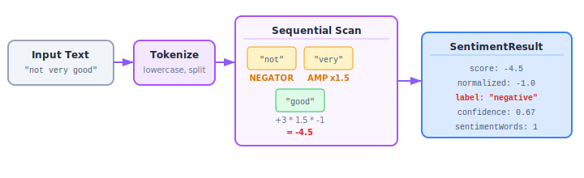

# Chapter 5: Sentiment Analysis

The `sentiment` module (`src/sentiment/`) provides lexicon-based sentiment scoring with negation detection and amplifier handling. It uses an AFINN-inspired word list to score text polarity.

```
05-fig-sentiment-pipeline.svg
```

<p align="center">

</p>

## How It Works

1. **Tokenize** the text (lowercase, preserve hyphens and apostrophes)
2. **Scan** each token sequentially:
   - If it's a **negator** (`not`, `no`, `never`, etc.) — activate negation for the next sentiment word
   - If it's an **amplifier** (`very`, `extremely`, etc.) — boost the next sentiment word
   - If it's a **sentiment word** — look up its score, apply any active negation/amplification
3. **Aggregate** into a normalized score and confidence metric

## Exports

| Export | Kind | Description |
|---|---|---|
| `analyzeSentiment` | Function | Analyze text sentiment |
| `compareSentiment` | Function | Compare sentiment of two texts |
| `getDefaultLexicon` | Function | Get a copy of the built-in lexicon |
| `NEGATORS` | Constant | `Set<string>` of negation words |
| `AMPLIFIERS` | Constant | `Record<string, number>` of amplifier words and their multipliers |
| `SentimentResultSchema` | Zod Schema | Validates `SentimentResult` shape |
| `SentimentResult` | Type | Result type for sentiment analysis |

## The Lexicon

The built-in lexicon contains 54 sentiment words scored from -5 (most negative) to +5 (most positive):

**Positive words** (score > 0):
`good` (+3), `great` (+4), `excellent` (+5), `amazing` (+5), `wonderful` (+4), `happy` (+3), `love` (+3), `best` (+4), `fantastic` (+4), `awesome` (+4), `positive` (+2), `success` (+3), `win` (+3), `winning` (+3), `winner` (+3), `beautiful` (+3), `perfect` (+4), `outstanding` (+4), `brilliant` (+4)

**Negative words** (score < 0):
`bad` (-3), `terrible` (-4), `awful` (-4), `horrible` (-4), `worst` (-4), `hate` (-4), `sad` (-2), `angry` (-3), `fail` (-3), `failure` (-3), `negative` (-2), `wrong` (-2), `problem` (-2), `crisis` (-3), `disaster` (-4), `ugly` (-2), `poor` (-2), `broken` (-2), `killed` (-3), `death` (-2), `attack` (-3), `war` (-3), `terror` (-4), `violence` (-3)

### Custom Lexicons

Pass a custom lexicon to override or extend:

```typescript
import { analyzeSentiment, getDefaultLexicon } from 'news-db-pure-analysis';

// Extend the default
const custom = {
    ...getDefaultLexicon(),
    'bullish': 3,
    'bearish': -3,
    'rally': 2,
    'crash': -4
};

analyzeSentiment('Markets rally on bullish signals', custom);
```

## NEGATORS

Words that flip the polarity of the next sentiment word:

```typescript
import { NEGATORS } from 'news-db-pure-analysis';
// Set { 'not', 'no', 'never', 'neither', "n't", 'none', 'nobody', 'nothing' }
```

When a negator precedes a sentiment word, the word's score is multiplied by -1.

```
"not good"  → good (+3) * negation (-1) = -3
"never fail" → fail (-3) * negation (-1) = +3
```

## AMPLIFIERS

Words that multiply the intensity of the next sentiment word:

```typescript
import { AMPLIFIERS } from 'news-db-pure-analysis';
// { 'very': 1.5, 'really': 1.3, 'extremely': 2.0,
//   'absolutely': 1.8, 'incredibly': 1.7, 'completely': 1.5, 'totally': 1.4 }
```

```
"very good"      → good (+3) * 1.5 = +4.5
"extremely bad"  → bad (-3) * 2.0 = -6.0
```

Negation and amplification can combine:

```
"not very good"  → good (+3) * 1.5 * negation (-1) = -4.5
```

**Reset rule:** Both negation and amplification are reset after being applied to a sentiment word. They do not persist across multiple words.

## analyzeSentiment(text, lexicon?)

```typescript
import { analyzeSentiment } from 'news-db-pure-analysis';

const result = analyzeSentiment('The movie was absolutely amazing but the ending was terrible');
// {
//   score: 5,             // Raw total: +5 (amazing*1.8) + -4 (terrible) = 5
//   normalizedScore: 0.83, // Clamped to [-1, 1]
//   label: 'positive',
//   confidence: 0.44,      // 2 sentiment words / 10 total words * 2
//   wordCount: 10,
//   sentimentWords: 2
// }
```

### SentimentResult

| Field | Type | Range | Description |
|---|---|---|---|
| `score` | `number` | unbounded | Raw sum of adjusted sentiment scores |
| `normalizedScore` | `number` | -1.0 to 1.0 | Normalized: `score / (sentimentWords * 3)`, clamped |
| `label` | `string` | `'positive' \| 'negative' \| 'neutral'` | Classification based on normalizedScore |
| `confidence` | `number` | 0.0 to 1.0 | Coverage-based confidence: `min(1, (sentimentWords / wordCount) * 2)` |
| `wordCount` | `number` | >= 0 | Total tokens in text |
| `sentimentWords` | `number` | >= 0 | Number of recognized sentiment words |

### Label Thresholds

| Condition | Label |
|---|---|
| `normalizedScore > 0.1` | `'positive'` |
| `normalizedScore < -0.1` | `'negative'` |
| otherwise | `'neutral'` |

## compareSentiment(textA, textB)

Compares sentiment between two texts.

```typescript
import { compareSentiment } from 'news-db-pure-analysis';

const result = compareSentiment(
    'This product is excellent and amazing',
    'This product is terrible and awful'
);
// {
//   aScore: 1,        // normalizedScore for text A
//   bScore: -1,       // normalizedScore for text B
//   difference: 2,    // absolute difference
//   agreementLabel: 'disagree'
// }
```

| Field | Type | Description |
|---|---|---|
| `aScore` | `number` | Normalized score for text A |
| `bScore` | `number` | Normalized score for text B |
| `difference` | `number` | `abs(aScore - bScore)` |
| `agreementLabel` | `'agree' \| 'disagree'` | Whether polarity matches |

The `agreementLabel` is `'agree'` if both texts have the same label, or if either is neutral. Otherwise `'disagree'`.

## Limitations

- The built-in lexicon is a **demonstration subset** (54 words). For production use, extend it with a full AFINN or domain-specific lexicon using `getDefaultLexicon()` as a base.
- Negation detection is **window-1**: it only applies to the immediately following sentiment word. Complex negation scopes ("I don't think it's not bad") are not handled.
- No sarcasm or irony detection.
- Designed for English text only.
