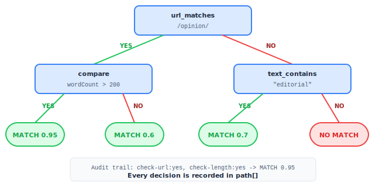

# Chapter 6: Decision Tree Classification

The `classification` module (`src/classification/`) provides a pure, JSON-configurable decision tree engine for pattern-based content classification. Trees produce audit trails for explainability.

```
06-fig-decision-tree.svg
```

<p align="center">

</p>

## How It Works

You define decision trees as JSON objects. Each tree is a binary tree of conditions. The engine walks the tree, evaluating conditions against a context object, following `yes`/`no` branches, and recording the path taken for explainability.

## Exports

| Export | Kind | Description |
|---|---|---|
| `evaluateTree` | Function | Evaluate a single decision tree against context |
| `evaluateAllTrees` | Function | Evaluate multiple named trees against context |
| `getMatches` | Function | Get only the matching trees from a set |
| `Condition` | Type | Condition node definition |
| `ConditionSchema` | Zod Schema | Validates `Condition` |
| `DecisionNode` | Type | Tree node (condition + yes/no branches or leaf result) |
| `DecisionNodeSchema` | Zod Schema | Validates `DecisionNode` |
| `EvaluationContext` | Interface | Input context to evaluate against |
| `PathStep` | Interface | One step in the evaluation audit trail |
| `EvaluationResult` | Interface | Final evaluation result |

## Condition Types

```
06-fig-condition-types.svg
```

<p align="center">

</p>

### url_matches

Tests the `url` field against a regex pattern.

```typescript
const condition: Condition = {
    type: 'url_matches',
    pattern: '/opinion/'
};
// Matches: https://example.com/opinion/article-title
// No match: https://example.com/news/article-title
```

If the regex is invalid, falls back to `url.includes(pattern)`.

### text_contains

Searches for a substring in the concatenation of `title` and `content` (case-insensitive).

```typescript
const condition: Condition = {
    type: 'text_contains',
    pattern: 'climate change'
};
```

### compare

Compares a context field against a value using an operator.

```typescript
const condition: Condition = {
    type: 'compare',
    field: 'wordCount',
    operator: '>',
    value: 1000
};
```

Supported operators: `>`, `<`, `>=`, `<=`, `==`, `!=`

The `field` can be any key in the `EvaluationContext`, including custom keys added via the index signature.

### flag

Checks if a boolean flag is set to `true` in `context.flags`.

```typescript
const condition: Condition = {
    type: 'flag',
    field: 'isPremium'
};
// True when context.flags.isPremium === true
```

### and

All sub-conditions must pass.

```typescript
const condition: Condition = {
    type: 'and',
    conditions: [
        { type: 'url_matches', pattern: '/opinion/' },
        { type: 'compare', field: 'wordCount', operator: '>', value: 500 }
    ]
};
```

### or

At least one sub-condition must pass.

```typescript
const condition: Condition = {
    type: 'or',
    conditions: [
        { type: 'url_matches', pattern: '/opinion/' },
        { type: 'url_matches', pattern: '/editorial/' }
    ]
};
```

`and` and `or` can be nested arbitrarily deep.

## Building Decision Trees

A `DecisionNode` is either a **branch** (has a `condition` + `yes`/`no` children) or a **leaf** (has a `result`).

```typescript
import { DecisionNode } from 'news-db-pure-analysis';

const opinionTree: DecisionNode = {
    id: 'check-url',
    condition: { type: 'url_matches', pattern: '/opinion/' },
    yes: {
        id: 'check-length',
        condition: { type: 'compare', field: 'wordCount', operator: '>', value: 200 },
        yes: { id: 'opinion-match', result: true, confidence: 0.95 },
        no: { id: 'opinion-short', result: true, confidence: 0.6 }
    },
    no: {
        id: 'check-text',
        condition: { type: 'text_contains', pattern: 'editorial' },
        yes: { id: 'text-match', result: true, confidence: 0.7 },
        no: { id: 'no-match', result: false, confidence: 0.9 }
    }
};
```

### DecisionNode Fields

| Field | Type | Required | Description |
|---|---|---|---|
| `id` | `string` | Yes | Unique identifier for audit trail |
| `condition` | `Condition` | No | Condition to evaluate (omit for leaf nodes) |
| `yes` | `DecisionNode` | No | Branch to follow if condition is true |
| `no` | `DecisionNode` | No | Branch to follow if condition is false |
| `result` | `boolean` | No | Leaf node match result |
| `confidence` | `number` | No | Confidence score for leaf result. Defaults to 0.8 for `true`, 0.2 for `false`. |

## evaluateTree(tree, context)

Evaluates a decision tree and returns a result with an audit trail.

```typescript
import { evaluateTree } from 'news-db-pure-analysis';

const result = evaluateTree(opinionTree, {
    url: 'https://example.com/opinion/climate-editorial',
    title: 'Climate Editorial',
    content: 'The time for action...',
    wordCount: 850
});

// {
//   match: true,
//   confidence: 0.95,
//   path: [
//     { nodeId: 'check-url', condition: 'URL matches "/opinion/"', result: true, branch: 'yes' },
//     { nodeId: 'check-length', condition: 'wordCount > 200', result: true, branch: 'yes' }
//   ],
//   reason: 'check-url:yes,check-length:yes'
// }
```

### EvaluationResult

| Field | Type | Description |
|---|---|---|
| `match` | `boolean` | Whether the tree matched |
| `confidence` | `number` | Confidence score from the leaf node |
| `path` | `PathStep[]` | Ordered audit trail of every decision |
| `reason` | `string` | Compact path summary (e.g., `'check-url:yes,check-length:yes'`) |

### PathStep

| Field | Type | Description |
|---|---|---|
| `nodeId` | `string` | ID of the node that was evaluated |
| `condition` | `string` | Human-readable description of the condition |
| `result` | `boolean` | Whether the condition passed |
| `branch` | `'yes' \| 'no'` | Which branch was taken |

## evaluateAllTrees(trees, context)

Evaluates multiple named trees and returns all results.

```typescript
import { evaluateAllTrees } from 'news-db-pure-analysis';

const trees = [
    { id: 'opinion', tree: opinionTree },
    { id: 'breaking', tree: breakingTree },
    { id: 'longform', tree: longformTree }
];

const results = evaluateAllTrees(trees, context);
// [
//   { id: 'opinion', result: { match: true, confidence: 0.95, ... } },
//   { id: 'breaking', result: { match: false, confidence: 0.9, ... } },
//   { id: 'longform', result: { match: true, confidence: 0.7, ... } }
// ]
```

## getMatches(trees, context)

Returns only the trees that matched (filters to `result.match === true`).

```typescript
import { getMatches } from 'news-db-pure-analysis';

const matches = getMatches(trees, context);
// [
//   { id: 'opinion', result: { match: true, ... } },
//   { id: 'longform', result: { match: true, ... } }
// ]
```

## Storing Trees as JSON

Decision trees are plain objects and can be stored as JSON, loaded from configuration files, or managed in a database:

```json
{
    "id": "check-opinion",
    "condition": {
        "type": "or",
        "conditions": [
            { "type": "url_matches", "pattern": "/opinion/" },
            { "type": "url_matches", "pattern": "/editorial/" }
        ]
    },
    "yes": { "id": "match", "result": true, "confidence": 0.9 },
    "no": { "id": "no-match", "result": false }
}
```

Use `DecisionNodeSchema.parse(json)` to validate loaded trees at runtime.
