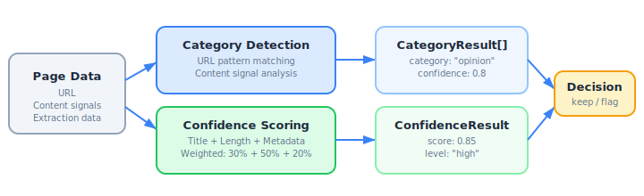

# Chapter 7: Content Analysis & Quality Scoring

The `content` module (`src/content/`) has two sub-systems: **category detection** (what kind of page is this?) and **confidence scoring** (how good is this extraction?).

```
07-fig-content-overview.svg
```

<p align="center">

</p>

## Part 1: Category Detection

Detects page types from URL patterns and content signals.

### Category Types

| Category | Description | Example URL Patterns |
|---|---|---|
| `inDepth` | Long-form investigative/feature content | `/in-depth/`, `/longform/`, `/investigations/`, `/features/`, `/magazine/` |
| `opinion` | Opinion pieces, editorials, columns | `/opinion/`, `/editorial/`, `/commentary/`, `/columns/`, `/perspectives/` |
| `live` | Live updates and breaking news | `/live/`, `/live-updates/`, `/breaking/`, `/developing/` |
| `explainer` | Explainers, guides, FAQs | `/explainer/`, `/explained/`, `/guide/`, `/what-is-`, `/how-to-` |
| `multimedia` | Video, audio, galleries, interactive | `/video/`, `/podcast/`, `/gallery/`, `/interactive/`, `/graphics/` |
| `hub` | Section/topic landing pages | `/world/`, `/politics/`, `/business/`, `/technology/`, `/science/` |

### Exports (Category Detection)

| Export | Kind | Description |
|---|---|---|
| `detectCategoriesFromUrl` | Function | Detect categories from URL patterns alone |
| `detectFromContentSignals` | Function | Detect categories from content metadata |
| `detectPageCategories` | Function | Combined URL + content detection |
| `getPrimaryCategory` | Function | Get highest-confidence category |
| `isCategory` | Function | Check if page is a specific category |
| `matchesPatterns` | Function | Test URL against regex pattern array |
| `CATEGORY_PATTERNS` | Constant | The regex patterns for each category |
| `CategoryType` | Type | Union of category names |
| `CategoryResult` | Type | Detection result shape |
| `CategoryResultSchema` | Zod Schema | Validates `CategoryResult` |

### detectCategoriesFromUrl(url)

Tests a URL against all category patterns.

```typescript
import { detectCategoriesFromUrl } from 'news-db-pure-analysis';

detectCategoriesFromUrl('https://bbc.com/news/in-depth/climate-report');
// [{ category: 'inDepth', confidence: 0.8, matchedPattern: '\\/in-depth\\/' }]

detectCategoriesFromUrl('https://cnn.com/opinion/editorial-on-policy');
// [{ category: 'opinion', confidence: 0.8, matchedPattern: '\\/opinion\\/' }]
```

URL-based detection always returns confidence `0.8`.

### detectFromContentSignals(signals)

Detects categories from content metadata.

```typescript
import { detectFromContentSignals } from 'news-db-pure-analysis';

detectFromContentSignals({ wordCount: 3500 });
// [{ category: 'inDepth', confidence: 0.85 }]

detectFromContentSignals({ hasVideo: true, linkDensity: 0.7 });
// [{ category: 'multimedia', confidence: 0.7 }, { category: 'hub', confidence: 0.6 }]
```

| Signal | Type | Detects |
|---|---|---|
| `wordCount > 2000` | `number` | `inDepth` (confidence scales with length, max 0.9) |
| `hasVideo: true` | `boolean` | `multimedia` (confidence 0.7) |
| `hasGallery: true` | `boolean` | `multimedia` (confidence 0.6) |
| `linkDensity > 0.5` | `number` | `hub` (confidence 0.6) |

### detectPageCategories(url, contentSignals?)

Combines both detection methods. When a category is detected by both URL and content signals, its confidence is boosted (additive with 0.5x weight on the second detection, capped at 1.0).

```typescript
import { detectPageCategories } from 'news-db-pure-analysis';

detectPageCategories('https://bbc.com/news/in-depth/climate', { wordCount: 4000 });
// [{ category: 'inDepth', confidence: 1.0, matchedPattern: '...' }]
// Confidence boosted because both URL and content signal matched
```

Results are sorted by confidence descending.

### getPrimaryCategory(url, contentSignals?)

Returns the single highest-confidence category, or `null` if none match.

```typescript
import { getPrimaryCategory } from 'news-db-pure-analysis';

getPrimaryCategory('https://example.com/opinion/article');
// { category: 'opinion', confidence: 0.8, matchedPattern: '...' }

getPrimaryCategory('https://example.com/random-page');
// null
```

### isCategory(url, category, minConfidence?)

Boolean check for a specific category.

```typescript
import { isCategory } from 'news-db-pure-analysis';

isCategory('https://bbc.com/live/election', 'live');      // true
isCategory('https://bbc.com/news/article', 'opinion');     // false
isCategory('https://bbc.com/live/x', 'live', 0.9);        // false (confidence 0.8 < 0.9)
```

### CATEGORY_PATTERNS

The raw regex patterns used for URL detection, exported for inspection or extension:

```typescript
import { CATEGORY_PATTERNS } from 'news-db-pure-analysis';

// CATEGORY_PATTERNS.opinion = [/\/opinion\//i, /\/editorial[s]?\//i, ...]
```

---

## Part 2: Confidence Scoring

Scores the quality of extracted content to identify unreliable extractions.

```
07-fig-confidence-scoring.svg
```

<p align="center">

</p>

### Exports (Confidence Scoring)

| Export | Kind | Description |
|---|---|---|
| `scoreConfidence` | Function | Score extraction quality (main entry point) |
| `scoreTitleQuality` | Function | Score title quality (0-1) |
| `scoreLengthQuality` | Function | Score content length (0-1) |
| `scoreMetadataCompleteness` | Function | Score metadata fields (0-1) |
| `scoreToLevel` | Function | Convert numeric score to level label |
| `getRecommendation` | Function | Generate quality recommendation string |
| `scoreBatch` | Function | Score multiple extractions at once |
| `filterLowConfidence` | Function | Filter to low-confidence items |
| `ExtractionInput` | Type | Input shape for scoring |
| `ExtractionInputSchema` | Zod Schema | Validates `ExtractionInput` |
| `ConfidenceResult` | Type | Scoring result shape |
| `ConfidenceResultSchema` | Zod Schema | Validates `ConfidenceResult` |

### scoreConfidence(extraction)

The main scoring function. Combines three weighted factors:

```typescript
import { scoreConfidence } from 'news-db-pure-analysis';

const result = scoreConfidence({
    title: 'Major Economic Policy Shift Announced',
    content: 'The government announced today... (850 words)',
    author: 'Jane Smith',
    publishDate: '2024-06-15',
    section: 'Politics',
    wordCount: 850
});
// {
//   score: 0.93,
//   level: 'high',
//   factors: { title: 1.0, length: 1.0, metadata: 1.0 },
//   recommendation: 'Content extraction looks reliable'
// }
```

### Scoring Weights

| Factor | Weight | Measures |
|---|---|---|
| **Title** | 30% | Title length and pattern quality |
| **Length** | 50% | Word count appropriateness |
| **Metadata** | 20% | Completeness of author/date/section |

### Title Scoring

| Condition | Score |
|---|---|
| No title or empty | 0.0 |
| Starts with error/404/loading pattern | 0.1 |
| Only digits | 0.2 |
| Length < 10 chars | 0.3 |
| Length > 200 chars | 0.5 |
| Length 10-200 chars | 0.8 |
| Length 20-150 chars (ideal) | 1.0 |

### Length Scoring

| Condition | Score |
|---|---|
| 0 words | 0.0 |
| < 50 words | 0.2 |
| 50-100 words | 0.5 |
| 100-500 words | 0.5-1.0 (linear interpolation) |
| 500-10000 words | 1.0 |
| > 10000 words | 0.6 (suspiciously long) |

### Confidence Levels

| Score Range | Level |
|---|---|
| >= 0.8 | `'high'` |
| >= 0.6 | `'good'` |
| >= 0.3 | `'medium'` |
| < 0.3 | `'low'` |

### scoreBatch(extractions)

Score multiple extractions at once:

```typescript
import { scoreBatch } from 'news-db-pure-analysis';

const results = scoreBatch([
    { id: 'art-1', extraction: { title: 'Good Title', content: '...', wordCount: 500 } },
    { id: 'art-2', extraction: { title: '', wordCount: 10 } }
]);
// [
//   { id: 'art-1', result: { score: 0.75, level: 'good', ... } },
//   { id: 'art-2', result: { score: 0.14, level: 'low', ... } }
// ]
```

### filterLowConfidence(scored, threshold?)

Filters and sorts to show only items below a confidence threshold (default 0.4):

```typescript
import { scoreBatch, filterLowConfidence } from 'news-db-pure-analysis';

const scored = scoreBatch(extractions);
const problems = filterLowConfidence(scored, 0.5);
// Sorted by score ascending (worst first)
```
