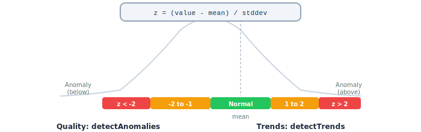
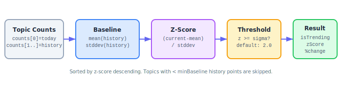

# Chapter 8: Trend Detection & Anomaly Detection

Two related modules use z-score statistics to find signals in time-series data: `trends` detects surging topics, and `quality` detects unusual values.

```
08-fig-zscore-overview.svg
```

<p align="center">

</p>

## Part 1: Trend Detection (`src/trends/`)

Detects trending topics by comparing current article counts against a historical baseline.

### Exports (Trends)

| Export | Kind | Description |
|---|---|---|
| `mean` | Function | Calculate the average of a number array |
| `stddev` | Function | Calculate population standard deviation |
| `calculateBaseline` | Function | Compute mean + stddev from historical data |
| `calculateTrendScore` | Function | Z-score and percent change for one topic |
| `detectTrends` | Function | Detect trends across multiple topics |
| `filterTrending` | Function | Filter to only trending results |
| `TopicCount` | Type | Daily topic count record |
| `TopicCountSchema` | Zod Schema | Validates `TopicCount` |
| `TrendResult` | Type | Trend analysis result |
| `TrendResultSchema` | Zod Schema | Validates `TrendResult` |

### How Trend Detection Works

```
08-fig-trend-detection.svg
```

<p align="center">

</p>

For each topic:
1. Take the most recent count as the "current" value
2. Take all prior counts as the "baseline"
3. Calculate the baseline mean and standard deviation
4. Compute the z-score: `(current - mean) / stddev`
5. If z-score >= threshold (default 2.0), the topic is **trending**

### mean(values) / stddev(values, avg?)

Basic statistical utilities:

```typescript
import { mean, stddev } from 'news-db-pure-analysis';

mean([10, 20, 30]);     // 20
stddev([10, 20, 30]);   // 8.16...
stddev([10, 20, 30], 20); // 8.16... (pre-computed mean)
```

`stddev` uses **population standard deviation** (divides by N, not N-1). Returns 0 for arrays with fewer than 2 elements.

### calculateBaseline(historicalCounts)

```typescript
import { calculateBaseline } from 'news-db-pure-analysis';

calculateBaseline([10, 12, 11, 13, 10, 12]);
// { mean: 11.33, stddev: 1.11 }
```

Values are rounded to 2 decimal places.

### calculateTrendScore(currentCount, baseline, sigmaThreshold?)

```typescript
import { calculateTrendScore } from 'news-db-pure-analysis';

const baseline = { mean: 10, stddev: 2 };

calculateTrendScore(15, baseline);
// { zScore: 2.5, percentChange: 50, isTrending: true }

calculateTrendScore(11, baseline);
// { zScore: 0.5, percentChange: 10, isTrending: false }
```

When `stddev` is 0 and `current > mean`, z-score defaults to 10 (strong trend signal).

### detectTrends(topicCounts, options?)

The main entry point. Accepts an array of topics, each with an ordered array of counts (most recent first).

```typescript
import { detectTrends } from 'news-db-pure-analysis';

const results = detectTrends([
    { topicId: 'climate', topicName: 'Climate', counts: [45, 10, 12, 11, 13, 10] },
    { topicId: 'sports', topicName: 'Sports', counts: [15, 14, 16, 15, 14] },
    { topicId: 'tech', topicName: 'Technology', counts: [30, 8, 9, 10, 8, 9] }
]);
// [
//   { topicId: 'climate', topicName: 'Climate', currentCount: 45, baselineMean: 11.2,
//     baselineStdDev: 1.17, zScore: 28.89, percentChange: 302, isTrending: true },
//   { topicId: 'tech', topicName: 'Technology', currentCount: 30, baselineMean: 8.8,
//     baselineStdDev: 0.75, zScore: 28.27, percentChange: 241, isTrending: true },
//   { topicId: 'sports', topicName: 'Sports', currentCount: 15, baselineMean: 14.75,
//     baselineStdDev: 0.83, zScore: 0.3, percentChange: 2, isTrending: false }
// ]
```

**Input format:** `counts[0]` is the current/most recent count. `counts[1..]` are historical counts.

| Option | Type | Default | Description |
|---|---|---|---|
| `sigmaThreshold` | `number` | `2.0` | Z-score threshold for "trending" |
| `minBaseline` | `number` | `3` | Minimum historical data points required |

Results are **sorted by z-score descending** (most trending first).

Topics with fewer than `minBaseline + 1` data points are skipped.

### filterTrending(results)

```typescript
import { detectTrends, filterTrending } from 'news-db-pure-analysis';

const all = detectTrends(topicCounts);
const trending = filterTrending(all);
// Only topics where isTrending === true
```

---

## Part 2: Anomaly Detection (`src/quality/`)

Detects statistical outliers in time-series data using the same z-score approach.

### Exports (Quality)

| Export | Kind | Description |
|---|---|---|
| `detectAnomalies` | Function | Full anomaly report for a time series |
| `isValueAnomalous` | Function | Check if a single value is anomalous |
| `TimeSeriesPoint` | Type | Data point: `{ date, value }` |
| `TimeSeriesPointSchema` | Zod Schema | Validates `TimeSeriesPoint` |
| `Anomaly` | Type | Annotated data point with z-score |
| `AnomalySchema` | Zod Schema | Validates `Anomaly` |
| `AnomalyReport` | Interface | Full report with all points and statistics |

### detectAnomalies(points, config?)

Analyzes an entire time series and flags outliers.

```typescript
import { detectAnomalies } from 'news-db-pure-analysis';

const report = detectAnomalies([
    { date: '2024-06-10', value: 100 },
    { date: '2024-06-11', value: 105 },
    { date: '2024-06-12', value: 98 },
    { date: '2024-06-13', value: 102 },
    { date: '2024-06-14', value: 250 },  // Spike!
    { date: '2024-06-15', value: 101 }
], { sigma: 2 });

// report.anomalies[4]:
// { date: '2024-06-14', value: 250, zScore: 3.45, isAnomaly: true, direction: 'above' }
// report.mean: 126
// report.stdDev: 54.4
```

### AnomalyReport

| Field | Type | Description |
|---|---|---|
| `anomalies` | `Anomaly[]` | Every data point annotated with z-score and anomaly status |
| `mean` | `number` | Mean of all values |
| `stdDev` | `number` | Population standard deviation |
| `threshold` | `number` | The sigma value used |

### Anomaly

| Field | Type | Description |
|---|---|---|
| `date` | `string` | ISO date string |
| `value` | `number` | The original value |
| `zScore` | `number` | Distance from mean in standard deviations |
| `isAnomaly` | `boolean` | `true` if `abs(zScore) > sigma` |
| `direction` | `'above' \| 'below' \| 'normal'` | Direction of the anomaly |

### isValueAnomalous(historicalValues, newValue, sigma?)

Quick check for a single incoming value against historical data.

```typescript
import { isValueAnomalous } from 'news-db-pure-analysis';

const history = [100, 105, 98, 102, 103, 101];

isValueAnomalous(history, 250);  // true  (way above normal)
isValueAnomalous(history, 104);  // false (within normal range)
isValueAnomalous(history, 50);   // true  (way below normal)
```

Returns `false` if historical data has fewer than 2 points.

## Z-Score Reference

| Z-Score | Meaning | % of Data Beyond |
|---|---|---|
| 1.0 | Slightly unusual | 31.7% |
| 2.0 | Unusual (default threshold) | 4.6% |
| 3.0 | Very unusual | 0.3% |
| 4.0+ | Extremely rare | < 0.01% |
