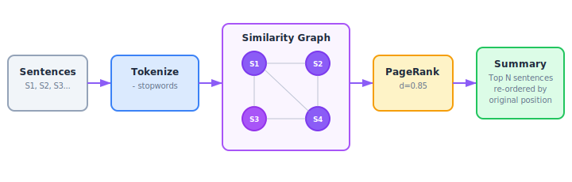
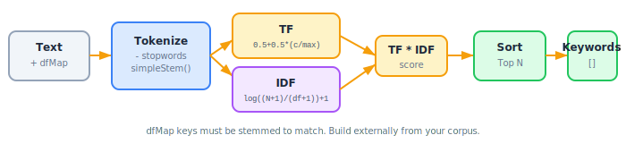

# Chapter 9: Extractive Summarization & Keyword Tagging

Two complementary modules for distilling content: `summarization` selects the most important sentences, and `tagging` extracts the most distinctive keywords.

## Part 1: Extractive Summarization (`src/summarization/`)

Uses the **TextRank** algorithm (a graph-based ranking method derived from PageRank) to identify the most important sentences in a text.

```
09-fig-textrank.svg
```

<p align="center">

</p>

### How TextRank Works

1. **Tokenize** each sentence (remove stopwords, lowercase)
2. **Build a graph** where sentences are nodes and edge weights are similarity scores
3. **Calculate similarity** using log-normalized overlap (from the original TextRank paper): `overlap(A,B) / (log(|A|) + log(|B|))`
4. **Run PageRank iterations**: `score(i) = (1-d) + d * sum(weight(j,i)/outDegree(j) * score(j))`
5. **Rank** sentences by their converged scores
6. For summaries, take the top N sentences and **re-order by original position** for coherent reading

### Exports (Summarization)

| Export | Kind | Description |
|---|---|---|
| `TextRank` | Class | TextRank implementation |
| `TextRankOptions` | Type | Configuration options |
| `TextRankOptionsSchema` | Zod Schema | Validates options |
| `RankedSentence` | Interface | A sentence with its rank score |

### TextRank Class

```typescript
import { TextRank } from 'news-db-pure-analysis';

const ranker = new TextRank({
    damping: 0.85,       // PageRank damping factor
    maxIterations: 100,  // Max convergence iterations
    convergence: 0.0001, // Convergence threshold
    minSimilarity: 0.1   // Minimum edge weight to include
});
```

### TextRankOptions

| Option | Type | Default | Description |
|---|---|---|---|
| `damping` | `number` | `0.85` | PageRank damping factor. Higher = more weight on graph structure vs. uniform distribution |
| `maxIterations` | `number` | `100` | Maximum iterations before stopping |
| `convergence` | `number` | `0.0001` | Stop when max score change < this value |
| `minSimilarity` | `number` | `0.1` | Minimum similarity threshold for graph edges |

### rank(sentences)

Ranks all sentences by importance. Returns them sorted by score descending.

```typescript
import { TextRank, splitSentences } from 'news-db-pure-analysis';

const ranker = new TextRank();
const sentences = splitSentences(articleText);
const ranked = ranker.rank(sentences);

// [
//   { index: 3, text: 'The most important sentence.', score: 1.82 },
//   { index: 0, text: 'The opening sentence.', score: 1.45 },
//   { index: 7, text: 'Another key point.', score: 1.31 },
//   ...
// ]
```

### RankedSentence

| Field | Type | Description |
|---|---|---|
| `index` | `number` | Original position in the input array (0-based) |
| `text` | `string` | The sentence text |
| `score` | `number` | TextRank score (higher = more important) |

### summarize(sentences, count?)

Extractive summarization: returns the top N sentences **re-ordered by their original position** for coherent reading.

```typescript
const ranker = new TextRank();
const sentences = splitSentences(articleText);

const summary = ranker.summarize(sentences, 3);
// Returns 3 most important sentences, in their original order
// [
//   { index: 0, text: 'Opening important sentence.', score: 1.45 },
//   { index: 3, text: 'The most important sentence.', score: 1.82 },
//   { index: 7, text: 'Another key point.', score: 1.31 }
// ]
```

| Parameter | Type | Default | Description |
|---|---|---|---|
| `sentences` | `string[]` | — | Sentences to rank |
| `count` | `number` | `3` | Number of sentences to extract |

### Usage Pattern

```typescript
import { TextRank, splitSentences } from 'news-db-pure-analysis';

function summarizeArticle(text: string, sentenceCount = 3): string {
    const sentences = splitSentences(text);
    const ranker = new TextRank();
    const summary = ranker.summarize(sentences, sentenceCount);
    return summary.map(s => s.text).join('. ') + '.';
}
```

### Dependencies

TextRank internally uses:
- `tokenize` from `src/text/` (with stopword removal)
- `jaccardSimilarity` from `src/recommender/` (imported but the actual similarity function used is the TextRank paper's log-normalized overlap)

---

## Part 2: TF-IDF Keyword Extraction (`src/tagging/`)

Extracts the most distinctive keywords from a document using Term Frequency-Inverse Document Frequency.

```
09-fig-tfidf.svg
```

<p align="center">

</p>

### How TF-IDF Works

1. **Tokenize** the text (remove stopwords, minimum length 3)
2. **Stem** each token using a simplified Porter stemmer
3. **Calculate TF** (Term Frequency): Augmented frequency to prevent bias toward longer documents
   - `TF(t) = 0.5 + 0.5 * (count(t) / max_count_in_doc)`
4. **Calculate IDF** (Inverse Document Frequency): How rare is this term across all documents?
   - `IDF(t) = log((N+1) / (df(t)+1)) + 1`
5. **Score** each term: `TF * IDF`
6. Return the top N terms sorted by score

### Exports (Tagging)

| Export | Kind | Description |
|---|---|---|
| `extractKeywords` | Function | Extract top keywords from text using TF-IDF |
| `calculateTF` | Function | Compute term frequencies for a token array |
| `calculateIDF` | Function | Compute inverse document frequency for a term |
| `simpleStem` | Function | Simple English stemmer |
| `Keyword` | Interface | `{ word: string, score: number }` |
| `DocumentFrequencyMap` | Type | `Map<string, number>` — maps terms to document counts |

### extractKeywords(text, dfMap, totalDocs, topN?)

The main entry point. Requires a **document frequency map** and total document count from your corpus.

```typescript
import { extractKeywords, DocumentFrequencyMap } from 'news-db-pure-analysis';

// Build the dfMap from your corpus (how many documents contain each term)
const dfMap: DocumentFrequencyMap = new Map([
    ['climat', 150],     // stemmed form
    ['polici', 200],
    ['elect', 300],
    ['presid', 250],
    ['economi', 180]
]);
const totalDocs = 10000;

const keywords = extractKeywords(
    'The president announced new climate policy affecting the economy',
    dfMap,
    totalDocs,
    5  // top 5
);
// [
//   { word: 'climat', score: 4.21 },
//   { word: 'polici', score: 3.95 },
//   { word: 'economi', score: 3.80 },
//   { word: 'presid', score: 3.65 },
//   { word: 'announc', score: 3.50 }
// ]
```

| Parameter | Type | Default | Description |
|---|---|---|---|
| `text` | `string` | — | Document text |
| `dfMap` | `DocumentFrequencyMap` | — | Map of stemmed term to document count |
| `totalDocs` | `number` | — | Total documents in corpus |
| `topN` | `number` | `10` | Number of keywords to extract |

**Important:** The `dfMap` keys must be **stemmed** (using `simpleStem` or the same stemming logic) to match the document processing. The `extractKeywords` function applies stemming to the input text internally.

### calculateTF(tokens)

Computes augmented term frequency for a token array.

```typescript
import { calculateTF } from 'news-db-pure-analysis';

const tf = calculateTF(['cat', 'dog', 'cat', 'bird', 'cat']);
// Map {
//   'cat' => 1.0,     // 0.5 + 0.5 * (3/3)
//   'dog' => 0.667,   // 0.5 + 0.5 * (1/3)
//   'bird' => 0.667   // 0.5 + 0.5 * (1/3)
// }
```

### calculateIDF(term, dfMap, totalDocs)

```typescript
import { calculateIDF } from 'news-db-pure-analysis';

const dfMap = new Map([['climate', 150]]);
calculateIDF('climate', dfMap, 10000);
// log((10001) / (151)) + 1 = 5.19...

calculateIDF('unknown', dfMap, 10000);
// log((10001) / (1)) + 1 = 10.21... (rare term = high IDF)
```

### simpleStem(word)

A simplified Porter-like stemmer handling common English suffixes:

```typescript
import { simpleStem } from 'news-db-pure-analysis';

simpleStem('running');   // 'runn'
simpleStem('processes'); // 'process'
simpleStem('policies');  // 'polici'
simpleStem('played');    // 'play'
simpleStem('happy');     // 'happi'
```

Handles: `-sses` → `-ss`, `-ies` → `-i`, trailing `-s`, `-eed` → `-ee`, `-ed`, `-ing`, `-y` → `-i` (after consonant).

**This is a simplified stemmer**, not a full Porter implementation. It works well enough for keyword extraction where approximate grouping is acceptable.

### Building a Document Frequency Map

The `dfMap` must be built from your corpus externally (since this is a zero-IO library):

```typescript
import { tokenize, simpleStem } from 'news-db-pure-analysis';

function buildDFMap(documents: string[]): Map<string, number> {
    const dfMap = new Map<string, number>();

    for (const doc of documents) {
        const tokens = tokenize(doc, { removeStopwords: true, minLength: 3 });
        const stems = new Set(tokens.map(simpleStem));

        for (const stem of stems) {
            dfMap.set(stem, (dfMap.get(stem) || 0) + 1);
        }
    }

    return dfMap;
}
```
