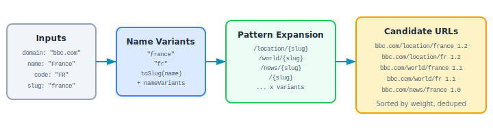

# Chapter 10: Geographic Hub URL Intelligence

The `geo` module (`src/geo/`) predicts likely hub page URLs for geographic locations on news websites, and analyzes geographic coverage gaps.

```
10-fig-geo-overview.svg
```

<p align="center">

</p>

## Use Case

When crawling news sites, you need to discover which URLs contain location-specific content. For a site like `apnews.com`, the UK hub might be at `/hub/united-kingdom`, `/world/uk`, or `/location/united-kingdom`. This module generates all likely candidates from a place name and a set of URL patterns.

## Exports

| Export | Kind | Description |
|---|---|---|
| `toSlug` | Function | Convert a name to a URL-safe slug |
| `generateNameVariants` | Function | Generate all slug variants for a place |
| `predictHubUrls` | Function | Predict candidate hub URLs for any place |
| `predictCountryHubUrls` | Function | Predict using country-specific patterns |
| `predictCityHubUrls` | Function | Predict using city-specific patterns |
| `extractPlaceSlugFromUrl` | Function | Extract a place slug from a URL |
| `analyzeGaps` | Function | Analyze geographic coverage gaps |
| `DEFAULT_COUNTRY_PATTERNS` | Constant | Built-in country URL patterns |
| `DEFAULT_CITY_PATTERNS` | Constant | Built-in city URL patterns |
| `PlaceMetadata` | Type | Place description shape |
| `PlaceMetadataSchema` | Zod Schema | Validates `PlaceMetadata` |
| `UrlPattern` | Type | URL pattern shape |
| `UrlPatternSchema` | Zod Schema | Validates `UrlPattern` |

## toSlug(name)

Converts a place name into a URL-safe slug.

```typescript
import { toSlug } from 'news-db-pure-analysis';

toSlug('United Kingdom');   // 'united-kingdom'
toSlug('São Paulo');        // 'sao-paulo'  (diacritics removed)
toSlug('New York City');    // 'new-york-city'
toSlug('Côte d\'Ivoire');   // 'cote-divoire'
```

Processing steps:
1. Lowercase
2. Unicode NFD normalization
3. Remove diacritical marks (`\u0300-\u036f`)
4. Remove non-alphanumeric characters (except spaces and hyphens)
5. Replace spaces with hyphens
6. Collapse multiple hyphens

## generateNameVariants(place)

Generates all possible URL slugs for a place, combining name, code, custom slug, and name variants.

```typescript
import { generateNameVariants } from 'news-db-pure-analysis';

generateNameVariants({
    name: 'United Kingdom',
    code: 'GB',
    slug: 'uk',
    nameVariants: ['Britain', 'Great Britain']
});
// ['united-kingdom', 'gb', 'uk', 'britain', 'great-britain']
```

## Default URL Patterns

### DEFAULT_COUNTRY_PATTERNS

| Pattern | Weight | Description |
|---|---|---|
| `/location/{slug}` | 1.2 | Location-specific hub |
| `/world/{slug}` | 1.1 | World news section |
| `/news/{slug}` | 1.0 | News section |
| `/{slug}` | 0.9 | Top-level path |
| `/topics/{slug}` | 0.8 | Topic pages |
| `/tag/{slug}` | 0.7 | Tag pages |
| `/region/{slug}` | 0.8 | Region pages |
| `/international/{slug}` | 0.6 | International section |

### DEFAULT_CITY_PATTERNS

| Pattern | Weight | Description |
|---|---|---|
| `/local/{slug}` | 1.2 | Local news |
| `/city/{slug}` | 1.1 | City-specific |
| `/news/{slug}` | 1.0 | News section |
| `/{slug}` | 0.9 | Top-level path |
| `/metro/{slug}` | 0.8 | Metro area |

Weights indicate expected likelihood of the pattern being correct. Higher weights are tried first.

## predictHubUrls(domain, place, patterns?)

Generates all candidate URLs by combining every name variant with every pattern.

```typescript
import { predictHubUrls } from 'news-db-pure-analysis';

const candidates = predictHubUrls('apnews.com', {
    name: 'United Kingdom',
    code: 'GB',
    slug: 'uk'
});
// [
//   { url: 'https://apnews.com/location/uk', weight: 1.2 },
//   { url: 'https://apnews.com/location/united-kingdom', weight: 1.2 },
//   { url: 'https://apnews.com/location/gb', weight: 1.2 },
//   { url: 'https://apnews.com/world/uk', weight: 1.1 },
//   { url: 'https://apnews.com/world/united-kingdom', weight: 1.1 },
//   ... (all combinations)
// ]
```

Results are sorted by weight descending and deduplicated.

If `domain` does not start with `http`, it is automatically prefixed with `https://`.

### Custom Patterns

```typescript
import { predictHubUrls, UrlPattern } from 'news-db-pure-analysis';

const customPatterns: UrlPattern[] = [
    { pattern: '/places/{slug}', weight: 1.5, isPrefix: false },
    { pattern: '/geo/{slug}/news', weight: 1.0, isPrefix: false }
];

predictHubUrls('mysite.com', { name: 'France' }, customPatterns);
// [
//   { url: 'https://mysite.com/places/france', weight: 1.5 },
//   { url: 'https://mysite.com/geo/france/news', weight: 1.0 }
// ]
```

## predictCountryHubUrls(domain, country) / predictCityHubUrls(domain, city)

Convenience wrappers that use the appropriate default patterns:

```typescript
import { predictCountryHubUrls, predictCityHubUrls } from 'news-db-pure-analysis';

predictCountryHubUrls('reuters.com', { name: 'Germany', code: 'DE' });
// Uses DEFAULT_COUNTRY_PATTERNS

predictCityHubUrls('reuters.com', { name: 'Berlin' });
// Uses DEFAULT_CITY_PATTERNS
```

## extractPlaceSlugFromUrl(url, patterns?)

Extracts a place slug from a URL by matching against patterns.

```typescript
import { extractPlaceSlugFromUrl } from 'news-db-pure-analysis';

extractPlaceSlugFromUrl('https://apnews.com/location/united-kingdom');
// 'united-kingdom'

extractPlaceSlugFromUrl('https://apnews.com/world/france');
// 'france'

extractPlaceSlugFromUrl('https://example.com/random/page');
// null
```

## analyzeGaps(knownPlaces, allPlaces)

Compares known (confirmed) hub pages against a complete place list to find coverage gaps.

```typescript
import { analyzeGaps, PlaceMetadata } from 'news-db-pure-analysis';

const known: PlaceMetadata[] = [
    { name: 'United States' },
    { name: 'United Kingdom' },
    { name: 'France' }
];

const all: PlaceMetadata[] = [
    { name: 'United States' },
    { name: 'United Kingdom' },
    { name: 'France' },
    { name: 'Germany' },
    { name: 'Japan' }
];

const gaps = analyzeGaps(known, all);
// {
//   covered: [{ name: 'United States' }, { name: 'United Kingdom' }, { name: 'France' }],
//   missing: [{ name: 'Germany' }, { name: 'Japan' }],
//   coveragePercent: 60
// }
```

Matching is done by comparing `toSlug(place.name)`.
