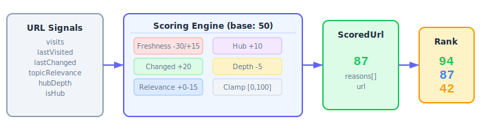
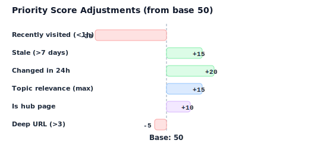

# Chapter 12: Crawl Planning & URL Prioritization

The `planning` module (`src/planning/`) scores and ranks URLs for crawl scheduling based on multiple signals.

```
12-fig-planning-overview.svg
```

<p align="center">

</p>

## Purpose

When managing a news crawler, you have thousands of URLs to visit but limited capacity. This module assigns a **priority score (0-100)** to each URL based on recency, change frequency, relevance, and structural signals so you can crawl the most valuable URLs first.

## Exports

| Export | Kind | Description |
|---|---|---|
| `scoreUrlPriority` | Function | Score a single URL's crawl priority |
| `rankUrlsForCrawling` | Function | Score and rank multiple URLs |
| `UrlSignals` | Type | Input: URL metadata and visit history |
| `UrlSignalsSchema` | Zod Schema | Validates `UrlSignals` |
| `ScoredUrl` | Type | Output: URL with priority score and reasons |
| `ScoredUrlSchema` | Zod Schema | Validates `ScoredUrl` |

## scoreUrlPriority(signals)

Computes a priority score for a single URL.

```typescript
import { scoreUrlPriority } from 'news-db-pure-analysis';

const result = scoreUrlPriority({
    url: 'https://reuters.com/world/europe',
    visits: 150,
    lastVisited: '2024-06-10T08:00:00Z', // 5 days ago
    lastChanged: '2024-06-14T22:00:00Z', // changed yesterday
    topicRelevance: 0.9,
    hubDepth: 1,
    isHub: true
});
// {
//   url: 'https://reuters.com/world/europe',
//   score: 94,
//   reasons: ['Changed in last 24h', 'High topic relevance', 'Is a hub page']
// }
```

## Scoring Algorithm

Starting from a **base score of 50**, the algorithm applies the following adjustments:

```
12-fig-scoring-factors.svg
```

<p align="center">

</p>

### 1. Freshness Decay (Penalize Recently Visited)

| Time Since Last Visit | Adjustment | Reason String |
|---|---|---|
| < 1 hour | **-30** | "Recently visited (<1h)" |
| < 24 hours | **-10** | "Visited today" |
| > 7 days | **+15** | "Not visited in 7+ days" |

### 2. Change Detection (Boost Recently Changed)

| Condition | Adjustment | Reason String |
|---|---|---|
| `lastChanged` within 24 hours | **+20** | "Changed in last 24h" |

### 3. Topic Relevance

| Condition | Adjustment | Reason String |
|---|---|---|
| Any relevance | **+0 to +15** (proportional to `topicRelevance`) | — |
| `topicRelevance > 0.8` | *(included in above)* | "High topic relevance" |

The formula is `Math.round(topicRelevance * 15)`.

### 4. Hub Priority

| Condition | Adjustment | Reason String |
|---|---|---|
| `isHub: true` | **+10** | "Is a hub page" |

### 5. Depth Penalty

| Condition | Adjustment | Reason String |
|---|---|---|
| `hubDepth > 3` | **-5** | "Deep URL" |

### Score Range

The final score is clamped to **0-100**.

| Score Range | Priority Level |
|---|---|
| 80-100 | Very high — crawl immediately |
| 60-79 | High — crawl soon |
| 40-59 | Medium — normal schedule |
| 20-39 | Low — defer |
| 0-19 | Very low — skip or deprioritize |

### Minimum / Maximum Possible Scores

- **Maximum:** 50 (base) + 15 (stale) + 20 (changed) + 15 (relevance) + 10 (hub) = **100** (capped)
- **Minimum:** 50 (base) - 30 (just visited) - 5 (deep) = **15**

## rankUrlsForCrawling(urls)

Scores multiple URLs and returns them sorted by priority (highest first).

```typescript
import { rankUrlsForCrawling } from 'news-db-pure-analysis';

const ranked = rankUrlsForCrawling([
    {
        url: 'https://reuters.com/world',
        visits: 10,
        lastVisited: new Date(Date.now() - 8 * 24 * 60 * 60 * 1000), // 8 days ago
        topicRelevance: 0.9,
        hubDepth: 0,
        isHub: true
    },
    {
        url: 'https://reuters.com/article/old-piece',
        visits: 50,
        lastVisited: new Date(Date.now() - 30 * 60 * 1000), // 30 min ago
        topicRelevance: 0.3,
        hubDepth: 4,
        isHub: false
    }
]);

// ranked[0].url === 'https://reuters.com/world'       (high score)
// ranked[1].url === 'https://reuters.com/article/...'  (low score)
```

The `reasons` array in each result provides a human-readable audit trail explaining why each URL received its score.

## Usage Patterns

### Basic Crawl Queue

```typescript
import { rankUrlsForCrawling, UrlSignals } from 'news-db-pure-analysis';

function buildCrawlQueue(urls: UrlSignals[], maxBatchSize = 100) {
    const ranked = rankUrlsForCrawling(urls);
    return ranked.slice(0, maxBatchSize).map(r => r.url);
}
```

### Score Threshold Filtering

```typescript
const ranked = rankUrlsForCrawling(urls);
const highPriority = ranked.filter(r => r.score >= 70);
const lowPriority = ranked.filter(r => r.score < 30);
```

### Diagnostics

```typescript
const ranked = rankUrlsForCrawling(urls);
for (const item of ranked.slice(0, 5)) {
    console.log(`${item.score} ${item.url}`);
    console.log(`  Reasons: ${item.reasons.join(', ')}`);
}
```

## Time Sensitivity

This module is **pure** but **time-aware**: `scoreUrlPriority` internally calls `new Date()` to compute the time since last visit and last change. This means:

- Results vary depending on when you call the function
- For deterministic testing, mock `Date` or use fixed timestamps relative to a known "now"
- The function itself is still side-effect-free (it reads the clock but writes nothing)
